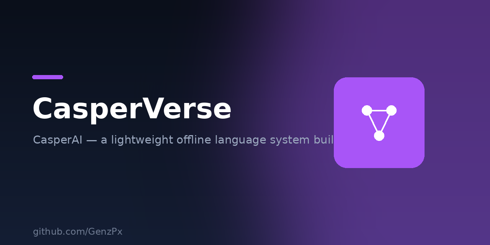
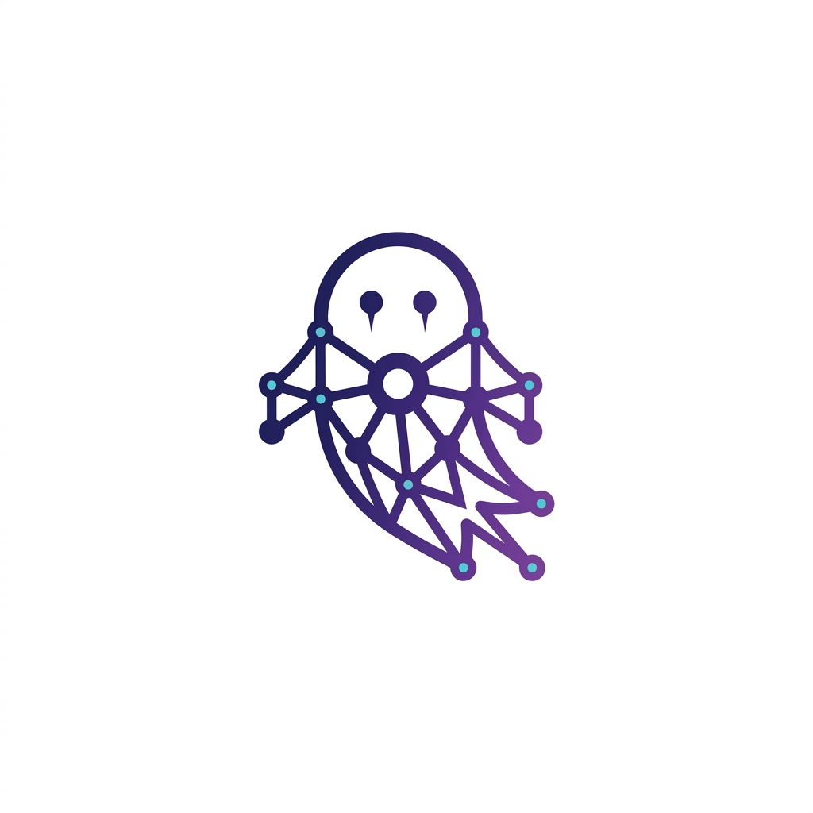

<p align="center">
  
</p>

<div align="center">



# CasperAI

**A lightweight, offline, multi-persona neural language system built from scratch with NumPy.**

[](https://www.python.org/)
[](https://numpy.org/)
[](#model-card)
[](LICENSE)

</div>

---

## Overview

CasperAI is an experimental local language system composed of **200 specialist
personas**. A context router selects a persona, deterministic handlers cover
identity, selected facts, safety, formatting, and arithmetic, while lightweight
RAG can retrieve supporting text from the local corpus.

It is intentionally small and educational. CasperAI is **not a Transformer LLM
and not a general reasoning system**. Its responses are produced by a hybrid of
small neural networks, routing rules, retrieval, and tools.

### Current release snapshot

- **200 routed personas**
- **24,157,690 measured numeric-array values** in the active `otak_casper.brain`
  artifact (approximately 24.16M; the original model-card count may differ
  slightly depending on counting convention)
- **158 word-level models + 42 character-level models**
- **~96.9 MB active model artifact** (`otak_casper.brain`)
- **~20.6 MB training corpus** (`regular.txt`)
- Offline inference with NumPy
- Character-level and embedding-based word-level models
- Local RAG, calculator/tool handling, safety guards, and basic topic memory

> **Parameter-count clarification:** the repository also contains two additional
> `otak_raksasa*.brain` artifacts, each measuring approximately 13.70M numeric
> values. Together with the active artifact they total approximately **51.56M**
> numeric-array values. The normal CLI currently loads only `otak_casper.brain`;
> the 51.6M figure should therefore be described as an aggregate, not as the
> active single model.

---

## Model Card

| Property | Current value |
|---|---|
| Routed personas | 200 |
| Active artifact | `otak_casper.brain` |
| Active artifact size | 96,940,752 bytes (~96.9 MB decimal) |
| Active numeric-array values | 24,157,690 (~24.16M) |
| Active model families | 158 token-level, 42 character-level |
| Word-level context | 8 tokens |
| Character-level context | 8–16 characters |
| Word-level architecture | Embedding → 2 dense tanh layers → softmax |
| Character-level architecture | One-hot character context → 2 dense tanh layers → softmax |
| Optimizer | Manual Adam implementation |
| Main dependency | NumPy |
| Training corpus | `regular.txt`, ~20.6 MB |
| Inference mode | Local CPU by default |

The parameter value above is a direct recount of serialized NumPy arrays. It is
not a claim that CasperAI has the same capability as a 24M-parameter modern
Transformer model.

---

## Features

### Persona routing

Questions are routed using keyword/pattern scoring and intent overrides. The
repository currently contains domains covering:

- Science, mathematics, physics, chemistry, biology, astronomy
- Law, history, politics, economics, research methodology
- Defensive cybersecurity, cryptography, privacy, OSINT, CTF, bug bounty
- Coding, hardware, gadgets, web development, JavaScript, HTML/CSS, WordPress
- Crypto, blockchain, trading, investing, budgeting, personal finance
- Psychology, emotions, empathy, stress management, relationships
- Education, university life, thesis writing, scholarships, study skills
- Careers, CVs, interviews, LinkedIn, freelancing, remote work
- Games, anime, film, music, sports, cooking, travel
- Creative writing, storytelling, plot, character development, photography,
  video, design, podcasting, blogging
- Indonesian culture, cuisine, traditions, regional languages, and arts

The complete persona mapping is defined in `casperverse.py` and the serialized
model keys are stored in `otak_casper.brain`.

### Deterministic handlers and tools

Some tasks are handled without neural sampling:

- Identity and creator attribution
- Selected high-confidence facts
- Safety and epistemic guards
- Structured tables and lists
- Arithmetic, parentheses, powers, square roots, percentages, negatives, and
  divide-by-zero handling

### Local retrieval

`rag.py` retrieves relevant blocks from `regular.txt` using lightweight lexical
scoring and reranking. Some answers expose a source and confidence indicator.
This is a local retrieval layer, not live web search.

### Self-learning pipeline

`belajar_online.py` can retrieve Wikipedia extracts, append them to local data,
and train an online model. Treat this as an experimental retraining pipeline,
not autonomous human-like learning. Validate data and model quality before
replacing a production artifact.

### Safety scope

Security personas are scoped to defense, education, awareness, and legal
activities. Harmful requests such as malware creation, credential theft, and
unauthorized account access are guarded and redirected toward defensive guidance.

---

## Installation

Requirements: Python 3.9+ and NumPy.

```bash
git clone https://github.com/GenzPx/CasperVerse.git
cd CasperVerse
python -m pip install numpy
```

### Termux

```bash
pkg update -y && pkg upgrade -y
pkg install python git -y
python -m pip install numpy
git clone https://github.com/GenzPx/CasperVerse.git
cd CasperVerse
```

---

## Usage

Run the interactive CLI:

```bash
python casperverse.py
```

Examples:

```text
› Halo, siapa nama kamu?
Casper: Namaku Casper — sering juga dipanggil CasperAI.

› 15% dari 240
Casper: 15% dari 240 = 36
```

Commands:

| Command | Description |
|---|---|
| `/bantu` | Show help |
| `/pakar` | List routed personas |
| `/pakai <nama>` | Pin one persona |
| `/auto` | Return to automatic routing |
| `/suhu <0.3-1.0>` | Change sampling temperature |
| `/panjang <n>` | Set generation length |
| `/keluar` | Exit |

---

## Training and development tools

| File | Purpose |
|---|---|
| `casperverse.py` | CLI, routing, tools, guards, RAG integration, generation |
| `otak_casper.brain` | Active 200-persona serialized artifact |
| `otak_raksasa.brain` | Additional large training artifact; not loaded by normal CLI |
| `otak_raksasa2.brain` | Additional large training artifact; not loaded by normal CLI |
| `train_besar.py` | Character-level trainer |
| `train_token.py` | Word-level embedding trainer |
| `train_cepat.py` | Smaller/faster word-level trainer |
| `train_raksasa.py` | Trainer for large standalone artifacts |
| `train_all.py` | Batch trainer |
| `gen_brains.py` | Educational corpus generator |
| `gen_brains_security.py` | Defensive security corpus generator |
| `gen_brains_v3a.py` | Additional education, games, career, and web domains |
| `gen_brains_v3b.py` | Additional productivity, finance, digital literacy, creative, and culture domains |
| `regular.txt` | Consolidated training corpus |
| `data_online/` | Downloaded local article extracts |
| `rag.py` | Lightweight local retrieval |
| `bpe.py` | Standalone BPE experiment/foundation; not the active model tokenizer |
| `belajar_online.py` | Wikipedia retrieval and experimental retraining loop |
| `evaluasi.py` | Per-domain loss evaluation |
| `eval_suite.py` | 145-item behavioral regression suite |
| `eval_hidden.py` | 36-item hidden/external-style suite |
| `eval_dataset.json` | Public evaluation prompts |
| `hidden_test.json` | Hidden-suite prompts shipped for reproducibility |
| `test_cli.py` | CLI regression tests |
| `validate_learning.py` | Self-learning/catastrophic-forgetting check |
| `EVAL_REPORT.md` | Evaluation history and results |

Train a small new persona:

```bash
python train_cepat.py corpus.txt my_persona.brain 60
```

Train a character-level model:

```bash
python train_besar.py corpus.txt my_persona.brain 80
```

---

## Evaluation

Training loss is not a sufficient measure of usefulness. The repository includes
behavioral tests for routing, factuality, abstention, instruction following,
math/tool use, safety, language/bias handling, and basic multi-turn behavior.

Run the checks:

```bash
python eval_suite.py
python eval_hidden.py
python test_cli.py
```

The current hidden-suite result observed in the repository was **35/36 = 97.2%**.
The public suite is a regression tool, not proof of general intelligence. The
hidden suite is also small and uses automated checks; add an external, private
holdout set for stronger validation.

For meaningful reporting, separate results from:

1. Neural persona generation.
2. Deterministic fact/identity/format handlers.
3. Local RAG.
4. Calculator and safety tools.

A perfect score on a small fixed suite does not establish broad factuality,
reasoning, or long-context conversational ability.

---

## Limitations

- Context windows remain short compared with modern LLMs.
- The system is a statistical pattern model, not a general reasoning engine.
- RAG quality depends on local corpus coverage and retrieval accuracy.
- The active CLI loads `otak_casper.brain`; the large standalone artifacts are
  not automatically combined with it.
- BPE exists as an experiment but is not yet integrated into the trained active
  model pipeline.
- Knowledge is limited by the corpus and deterministic fact database.
- Self-learning requires filtering, evaluation, rollback, and source validation.
- Pickle artifacts should only be loaded from trusted sources.
- Peak RAM and speed should be benchmarked on target devices rather than assumed.

---

## Roadmap

- [x] 200 routed personas
- [x] Local RAG with confidence/source metadata
- [x] Deterministic identity, safety, and calculator handlers
- [x] CLI regression tests
- [x] Hidden/external-style evaluation
- [ ] Integrate or clearly separate the large standalone artifacts
- [ ] Integrate BPE into training and inference
- [ ] Expand private holdout evaluation and human review
- [ ] Improve semantic routing and multi-intent handling
- [ ] Stronger long-context conversation memory
- [ ] One-command installer

---

## License

MIT. See [LICENSE](LICENSE).

Created by **Gen Z**, also known as **genzxseventh**. Released for research and
education.
